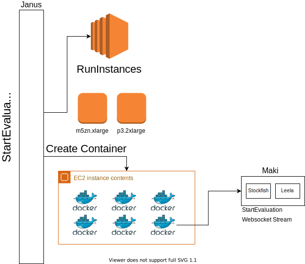

# Janus

### What is Janus?

#### Janus is the request router / fleet manager in charge of accepting requests from clients to evaluate a chess position or perform some other resource-intensive task. Janus ensures that the correct EC2 capacity and docker containers are available to serve the request as required.

At the time of writing, Janus supports the following APIs:

* StartEvaluation

## Design

## Components

### Janus Server

The Janus server is the target project for this monorepo - i.e., the final result of building this entire repository is the docker container containing the Janus server software.

### Janus API Model

The API model is package shared by the Janus server and the Janus client.
